# Airline Ticket Reservation

A simple airline ticket reservation system using linked lists.

## Problem statement

The problem statement is taken from `Data Structure And Algorithms In C++ 2nd ed by Adam Drozdek` - `Chapter 3` - `Programming assignments`. The problem statement is -

Write a simple airline ticket reservation program. The program should display amenu with the following options - reserve a ticket, cancel a reservation, check whether a ticket is reserved for a particular person, and display the passengers. The information is maintained on an alphabetized linked list of names. Create a linked list of flights with each node including a pointer to a linked list of passengers.

## Dev

- `Trivia` - This was made back in April 2015 during my 2nd semester of graduation.
- The editor used was `codeBlocks`, so the codeBlocks files have been kept to make it easier to recompile.
- You may write your own `makefile` if you don't want to use `codeBlocks` to compile.
- Formatting was done while pushing it to github with `clang` formatter.

## Data structure

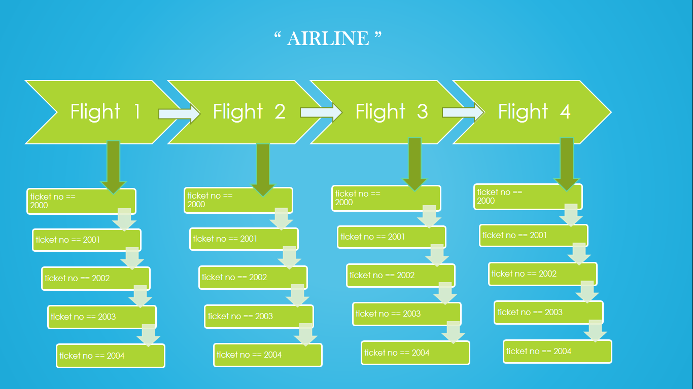

## Available functions

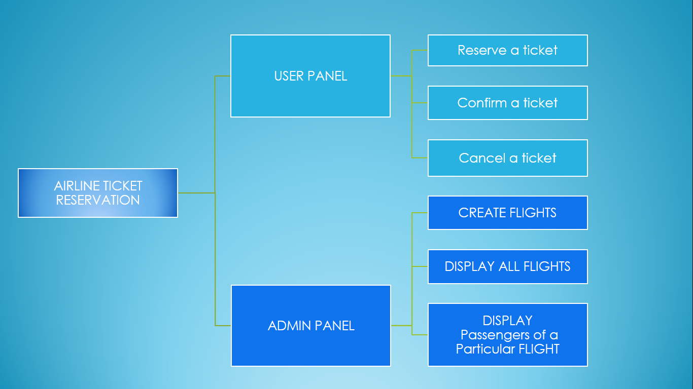

## Demo flow

1. Create flights using admin panel
2. Return back to main menu
3. Then tickets can be booked using user panel

## Screenshots

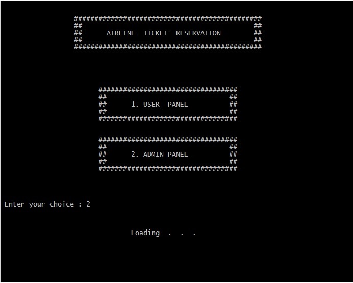
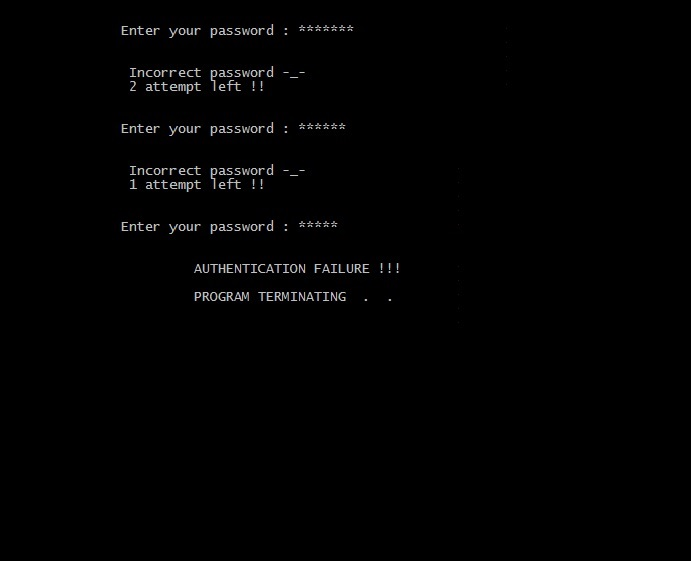

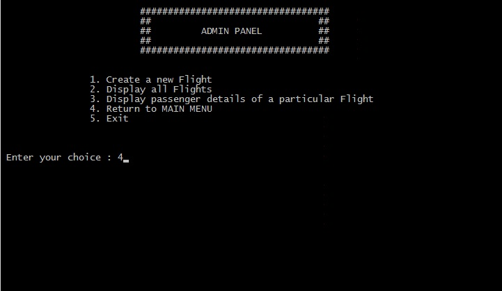
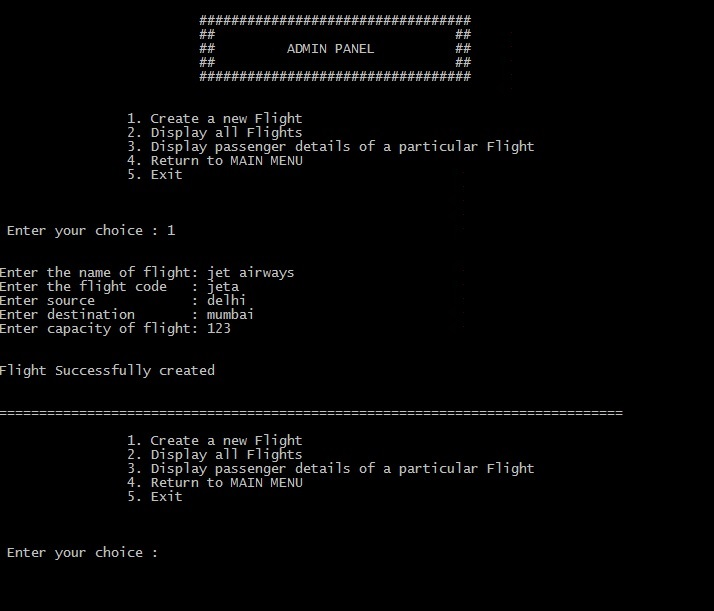
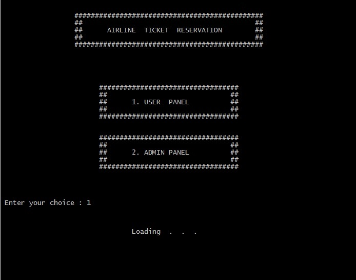
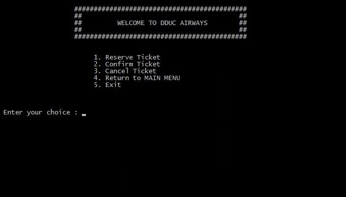
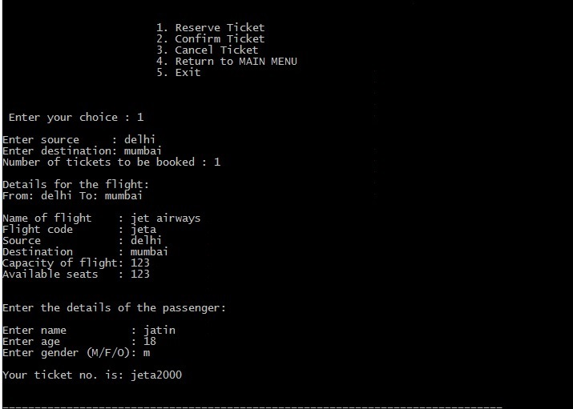
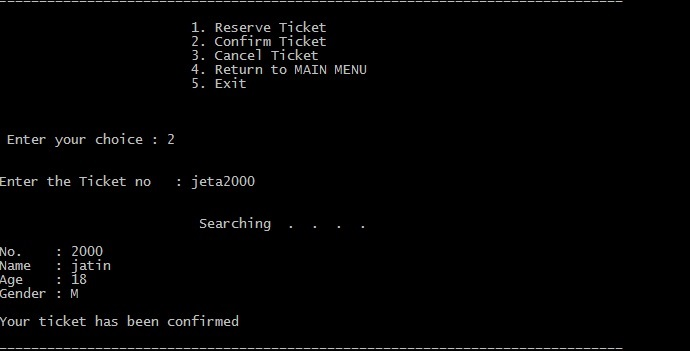
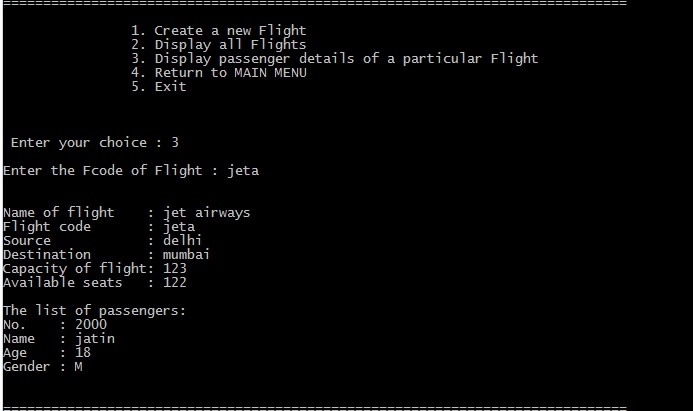
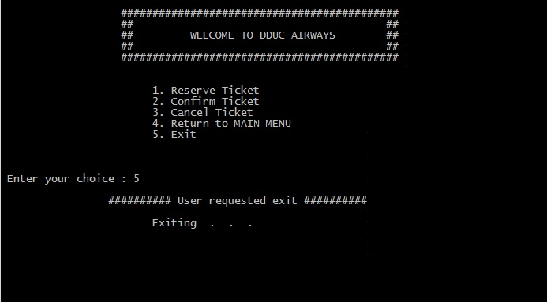
